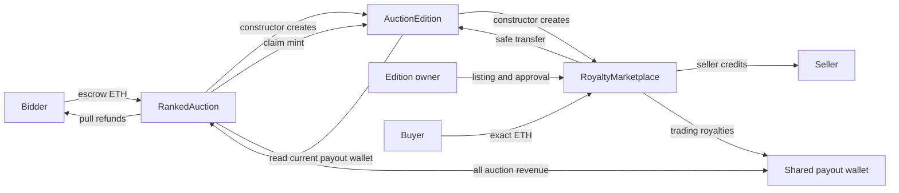

# Architecture and security model

## Contract bindings



Construction is atomic. `AuctionEdition.auction` is its deploying auction; `RoyaltyMarketplace.edition` is its deploying edition. There is no separate initialization transaction, temporary administrator, mutable validator, or binding race. Each contract's runtime is independently below the EIP-170 limit, and the auction creation code is below EIP-3860's limit.

## Auction state

The constructor fixes `initialEndTime = uint256(startTime) + 48 hours` and initializes `endTime` to it. `phase()` derives Scheduled, Live and Ended from timestamps until `settled` is true. `[startTime, endTime)` is the only bidding interval; settlement is allowed from `endTime` onward. Settlement sets the clearing price once and walks the bounded winner list to assign token IDs 1 through the winner count in final rank order. These assignments cannot change, regardless of the order in which winners claim. No transaction can reopen the auction.

`createBid()` and `createBids(amounts)` share the private `_createBid(bidder, bidAmount)` implementation. The batch entry point accepts 1–90 amounts, checks the exact total ETH once, then applies each independent bid in input order. Only the explicit individual amount is credited to its bid and escrow. The same updated reserve/floor checks, original-ID tie priority, displacement credits and extension logic apply after each insertion. An invalid later entry reverts the entire transaction. No external call, delegatecall, forwarding router or extra custody contract is involved. A later batch item can displace an earlier item; only current active bids compete for the 90 winning places. The per-transaction bound does not cap a wallet's historical bids.

Each bid is a fully funded one-unit offer. IDs are monotonic checked `uint256` counters. Bid amounts are explicitly bounded to `uint128.max` **before** narrowing. All aggregates and percentages use `uint256`, leaving ample room for 90 maximum-size bids. Percentage increments round upward, including at a reserve of 1 wei. If a theoretical floor plus its increment exceeds the maximum bid, new bids become impossible but settlement remains available.

Before all 90 places are occupied, a new bid needs only the reserve. At capacity, it must exceed the lowest winning bid by at least 5%, rounded up to a wei. Raising an existing active bid still requires adding at least 2.5% of that bid's amount.

A descending doubly linked list contains at most 90 active bids after every transaction; insertion transiently permits 91 before eviction. A head-to-tail search is bounded by this cap. Its storage reads are O(90), pointer writes O(1). There are no user-provided hints, off-chain ranks, Merkle roots, linked-list callbacks, or unbounded loops over historical bids. Withdrawals and historical bid records do not grow the active list.

Equal amounts favor smaller original bid IDs, including after an increase. Eviction removes the lowest-ranked bid, retains its history, and credits its entire escrow to its original bidder. Removed bids cannot be increased, win, or receive a second refund. A bidder cannot cancel an active offer.

New bids extend the auction inside the final ten minutes. An increase extends it only when its predecessor changes, which is equivalent to its rank changing because amounts only increase. An increase that retains its rank, including an increase in the clearing floor, does not extend the auction. This is an explicit reference-compatible rule. Every qualifying extension sets the deadline to ten minutes after that bid, with no fixed limit on total extension. The current deadline uses uint256, so extensions do not narrow back into the uint64 initial configuration range. Timestamp checks do not assume ordering within an Ethereum slot, and transactions submitted near a boundary may be included after it.

## ETH invariants

At every transaction boundary:

```text
auction.balance >= escrow + totalRefunds + pendingProceeds
totalRefunds = sum(unwithdrawn credited refunds), until recovery
market.balance >= totalCredits = sum(credits[seller]) + market.pendingRoyalties
```

Without forced ETH, both inequalities are equalities. Forced ETH does not influence ranking, allocation, clearing prices, normal proceeds or refund credits. After settlement and the 28-day recovery delay, auction surplus is included in `withdrawUnclaimedETH`; marketplace surplus has no new recovery path.

Before settlement, `escrow` is the sum of all active bids. Each eviction moves its payment from `escrow` to `refunds` and `totalRefunds`. Settlement computes `gross = topBid + clearingPrice * (activeCount - 1)` for a nonempty auction, or zero for an empty auction, removes exactly `gross` from `escrow`, and credits all of it to `pendingProceeds`. There is no primary-auction royalty. The head bid pays its full amount; all other winners pay the lowest winning bid at 90 occupied places, or reserve below capacity. A sole winner pays its full bid. Afterwards `escrow` contains only uncredited winner overpayments. `creditRefunds` moves each winner's `bid.amount - winningBidCost(id)` into that bidder's refund credit exactly once; duplicate credit requests are idempotent. While `refundsClosed` is false, withdrawal zeros the caller's entitlement before the ETH interaction. A failure reverts the entire withdrawal, preserving the entitlement.

Auction revenue can be withdrawn before any NFT claim. Refund entitlements remain available until a successful recovery, which is only allowed 28 days after settlement; mint entitlements have no expiry. There is no dependence on the payout wallet, other bidders or any recipient callback to finish settlement. A rejecting ETH recipient can be changed by the entitled caller.

## NFT invariants

```text
tokensClaimed <= activeCount <= 90
reservedClaimed = 10 - reservedRemaining
edition.totalSupply = tokensClaimed + unsold units claimed + reservedClaimed
edition.totalSupply + unclaimed winning units + unsoldRemaining + reservedRemaining = 100  (after settlement)
```

Mint claims accept 1–90 bid IDs and resolve their assigned ERC-721 token IDs. All claim flags and the aggregate claimed count are updated before the collection safely mints each NFT, with a separate ERC-721 receiver check for each token. A receiver rejecting a later NFT rolls back every mint and claim flag in that transaction; the winner can retry a smaller batch or choose a different recipient. During the batch, the collection increments totalSupply for each NFT before its callback. The supply equations above apply at transaction boundaries. Only a bid's owner can initiate its mint and choose the recipient. Third parties cannot force delivery to a bidding wallet ahead of the winner's redirect. Duplicates or an invalid bid revert the entire mint batch. Refund crediting is a separate operation so a failed receiver never locks the overpayment. The owner can retry with a compliant receiver. Unclaimed NFT entitlements never expire or become unsold inventory.

Minting is auction-only and capped again in the token contract. There is no burn path and therefore no burn/remint cap bypass. The current payout wallet can claim only `90 - winningCount` unsold units. Winning ranks reserve IDs 1 through winningCount. Unsold claims mint sequential IDs from winningCount + 1 through 90, so they cannot consume a winner’s reserved token. The ten reserved NFTs occupy IDs 91–100. The current payout wallet may claim them independently in batches of 1 through `reservedRemaining`, at any auction phase. Reserved and unsold counters decrement before safe-mint callbacks and roll back with any failed batch. Two-step wallet rotation moves only unclaimed inventory authority; already minted NFTs remain with their owners. Neither inventory pool can consume a winning ID or each other's allocation. Reserved mints create no ETH proceeds or royalties.

## Off-chain metadata boundary

Each minted ID returns `metadataURI + decimal(tokenId) + ".json"`. The deployment base must be nonempty and end in `/`; it never changes on-chain. Collection name and symbol are fixed. There is no enumerable extension; ownership can be read over the fixed 1–100 range.

The server initially serves unrevealed metadata for every token, including IDs 91–100. Creator-controlled availability and each holder's reveal request are enforced by a future off-chain service, not by this contract. No on-chain reveal flag, reveal authority, URI setter, ERC-4906 interface or metadata event exists. Rarest #1 is a metadata convention backed by the guaranteed final-rank ID assignment; artwork rarity is not proven on-chain. HTTPS content can change without a blockchain transaction, so hosting availability and integrity are trusted.

Off-chain reveals do not advance the transfer nonce and cannot automatically invalidate marketplace listings. Sellers should cancel affected listings before revealing/changing metadata. The metadata backend needs its own creator authentication, current-owner verification, replay protection, release policy and marketplace cache handling; none is asserted to be implemented by this contract package.

## Secondary market

Each listing records a seller, a specific token ID, an immutable ETH price, expiry, an active flag and the token's transfer nonce at listing time. Listing requires ownership and either per-token or collection-wide approval of the marketplace. Buying requires an active, unexpired listing, the same transfer nonce and valid approval. ERC-721 transfer authorization also verifies the seller/from binding. Exact payment is required.

Every secondary transfer, including a self-transfer, advances the collection's transfer nonce. This invalidates other listings created before that transfer. An old listing therefore cannot revive when an NFT returns to its previous owner. Revoking and later restoring approval without a transfer can re-enable a still-active, unexpired listing. Sellers may explicitly cancel any of their active listings, including a stale one. New listings always receive a fresh listing ID.

A purchase marks the listing inactive, computes the royalty on that token's full declared price with ceiling division, increments the separate pendingRoyalties pool, credits the seller with price minus royalty, and safely transfers that one NFT. No ETH is pushed during the sale. A rejected receiver reverts all ownership, nonce, listing and credit changes. A seller who is also the payout wallet withdraws seller credit and royalties separately. Accepted wallet rotation never changes personal seller credits. A 100% royalty leaves zero seller proceeds. There are no quantities or partial fills.

ERC-721 _update enforces the marketplace restriction for transferFrom and both safeTransferFrom variants. The mint exception is reachable only through the auction-authorized mint entry point. Nonexistent IDs cannot be minted through public transfer functions. Token-specific approve and collection-wide setApprovalForAll permit only the marketplace as a recipient of positive approval; revocation remains possible. There is no market entry point for an unpaid transfer.

## Shared payout wallet

`RankedAuction.payoutWallet` is the single source of payout authority. `AuctionEdition.royaltyRecipient()` reads it through the immutable auction binding. The marketplace resolves the same wallet through `royaltyInfo(1, 0)` when royalties are withdrawn. No cross-contract setter or synchronization transaction is needed.

Only the current wallet can call `proposePayoutWallet(newWallet)` or `cancelPayoutWalletChange()`. Only the pending wallet can call `acceptPayoutWallet()`. Acceptance clears the pending address, updates the current wallet, and emits an event without sending funds. A current wallet can replace or cancel an unaccepted nomination. Zero, current, auction, edition and marketplace addresses are rejected as nominees. System addresses are also rejected during construction.

After acceptance the old wallet loses authority over all unwithdrawn auction proceeds, all accrued/future trading royalties, and unclaimed reserved/unsold NFTs. The old wallet still owns its personal seller credits, bids, unrecovered refunds and winning NFTs. Already withdrawn funds never move. All auction settings and the royalty percentage stay fixed. This same role controls unclaimed reserved and unsold inventory, but cannot take a winner's ID, change the metadata base, set off-chain reveal permissions through the contract or take personal seller credits or bidder refunds before recovery eligibility. After the recovery delay it can recover unclaimed auction ETH; this successful action closes outstanding bidder refunds. Every state-changing auction payout-management, inventory-claim and withdrawal entry point is nonReentrant. No extra recovery authority exists if the current key is lost before a nomination.

## Comparison to the reference

| TLRankedAuction reference | This system |
|---|---|
| Escrowed ERC-721 prize list, 2–512 prizes | Minted ERC-721 IDs 1–90 by auction rank plus reserved 91–100, fixed lifetime cap |
| Configurable owner setup/reset before bids | Fixed auction configuration; limited two-step shared payout-wallet rotation |
| Hinted linked-list insertion | Bounded head traversal and deterministic original-ID ties |
| Flooring bid increments and narrowing casts | Ceiling increments and explicit narrowing bounds |
| Best-effort automatic refunds with a recovery bucket | Refund credits only; no bidder callback during bidding |
| Rank processing before claims | One bounded pass assigns each winner its final-rank token ID |
| Per-prize NFT failure recovery | Independent refunds and retryable safe ERC-721 batch claims |
| Owner proceeds | 100% of auction revenue to the shared payout wallet; royalties only on resales |
| No collection transfer policy in the auction | Fixed trading royalty rate, shared mutable recipient, restricted royalty-paying market |

The reference source is preserved as `.sol.txt` for review and is not compiled or deployed. The reference's ERC-721 tests cannot serve as an audit of this adaptation. This package uses its own independent array model, adversarial receivers, lifecycle and mutation tests.

## Optional recovery of unclaimed ETH

`RECOVERY_DELAY` is fixed at 28 days. The first successful `settle()` records
the transaction timestamp in `settledAt`; `recoveryAvailableAt()` then returns
`settledAt + 28 days`. Repeated settlement reverts and cannot reset the timer.
Before settlement the getter returns only an earliest estimate, `endTime + 28
days`, which moves with extensions. It is not an active recovery timer; settlement
is required and may move eligibility later. This timestamp does not expire refunds.

Late settlement therefore leaves winners a full 28 days in which recovery cannot
take their overpayments. A payout contract attempting settlement and immediate
recovery in one transaction reverts the whole transaction. Anyone may settle
after bidding ends; no creator signature is needed to open winner refunds.

`refundsClosed` starts false. Both `creditRefunds` and `withdrawRefund` remain
available regardless of elapsed time until a successful recovery sets it true.
`refunds(wallet)` reports the credited amount until closure and zero afterwards.
Private ledger entries and per-bid history may remain after recovery, but cannot
be used to recreate liabilities or withdraw funds.

After settlement and at/after eligibility, only the current `payoutWallet` may
call `withdrawUnclaimedETH(recipient)`. It sends the entire remaining auction
balance: displaced-bid credits, credited or uncredited winner excess,
unwithdrawn primary proceeds and any forced ETH surplus. Under the reentrancy
guard it sets `refundsClosed = true` and zeros `escrow`, `totalRefunds` and
`pendingProceeds` before calling the recipient. A failed transfer reverts the
closure flag and all accounting; refunds remain available for withdrawal.
An empty recovery also reverts without closing refunds. Following a successful
recovery, later forced ETH can be recovered by another call; refunds stay closed.

Before recovery, `totalRefunds` equals the sum of the public credited refunds,
including after day 28. `liabilities()` sums the three accounting buckets and
excludes forced surplus. After recovery all three buckets and public refunds
are zero. Token allocation, NFT claims and marketplace seller credits/royalties
retain their independent lifecycle. Normal `withdrawProceeds` never closes
refunds and remains available after settlement until the proceeds are withdrawn
or included in recovery.

After eligibility, transaction ordering decides which payments complete first:
a bidder withdrawal mined first receives its refund and reduces the recoverable
balance; a recovery mined first closes remaining refunds. Merely broadcasting a
recovery, a reverted transaction, and passage of time have no closing effect.
